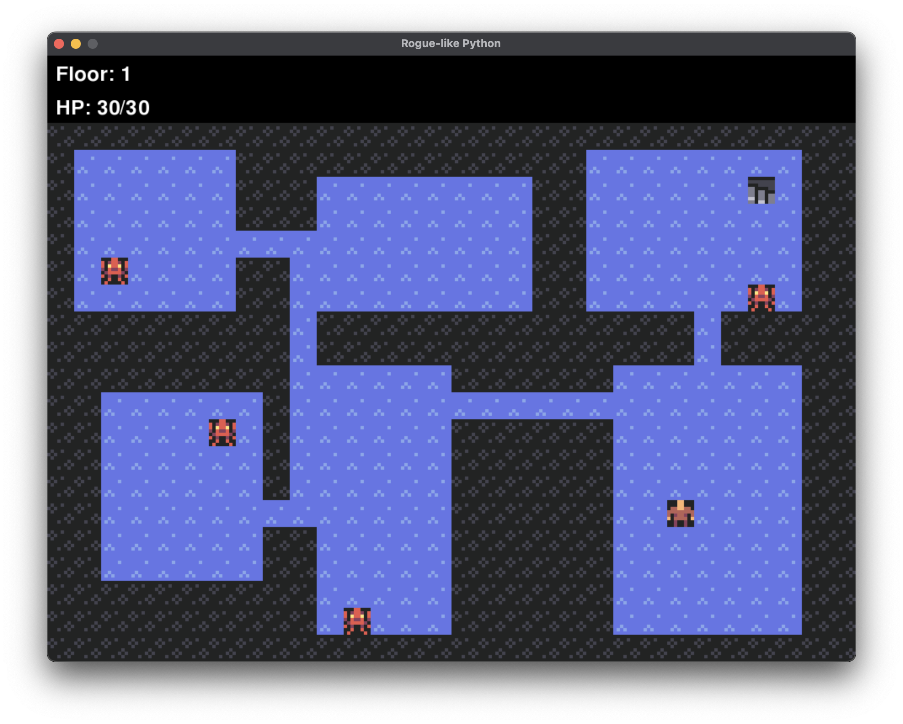

# Rogue-like Python

PythonとPygameを使用し、GitHub CopilotおよびGeminiでバイブコーディングを行いました。
現在はとりあえずは動くというレベルです。

また時間に余裕ができたら続きを作ってみる予定



## 開発の目的と背景
* **目的:** 生成AIを開発プロセスに組み込み、未知のアルゴリズム（BSP、A*）を含むゲームを短期間で形にすること。
* **開発期間:** 1週間
* **使用言語等:** Python 3.12.12, Pygame 2.6.1
* **開発ツール:** GitHub Copilot, Gemini, VS Code

## LLM の利用
本プロジェクトは、AIツールによるコード生成を主体として開発を行いました。

* **自分:**
    * ゲームの仕様策定と要件定義
    * AIへのプロンプトエンジニアリング（詳細な指示出し）
    * 生成されたコードの動作確認、デバッグ、結合
    * ファイル構成やクラス設計の方針決定

* **LLM (GitHub Copilot Agent/ Gemini):**
    * ダンジョン生成ロジック（BSP法）のコーディング
    * 経路探索アルゴリズム（A*法）の実装
    * Pygameを用いた描画処理のボイラープレート記述

## 主な機能と設計

### 手続き型ダンジョン生成
マップ生成には、二分空間分割法を採用しました。
Geminiに対して「部屋が重ならないように分割し、それらを通路で繋ぐ」という指示を与えました。

### 敵キャラクターの追跡動作
敵が壁を避けてプレイヤーを追尾する機能には、A*アルゴリズムを使用しました。
複雑な経路探索ロジックはCopilotに記述してもらいました。

### コード
* `dungeon.py`: マップ生成ロジック
* `entities.py`: エンティティ定義
* `game.py`: ゲームのメインループとイベント処理
* `pathfinding.py`: A*アルゴリズム
* `settings.py`: パラメータ設定

### テクスチャとアセット
シンプルなドット絵スタイルのテクスチャを使用し、視認性を確保しました。アセットはフリー素材 https://kenney.nl/assets/micro-roguelike から取得しました。

## インストールと実行方法

> 以下 Pixi がインストールされている前提

```bash
git clone [https://github.com/あなたのID/rogue-like-python.git](https://github.com/あなたのID/rogue-like-python.git)
cd rogue-like-python
pixi install
python main.py
